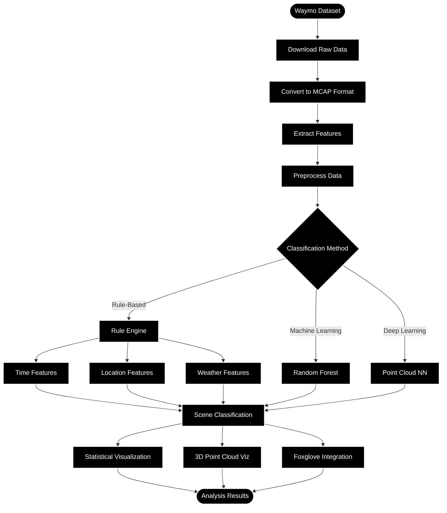

# Scene Classification and Visualization Tools Based on Waymo Dataset

## Table of Contents
- [Project Overview](#project-overview)
- [Project Architecture](#project-architecture)
- [Installation and Setup](#installation-and-setup)
- [Data Preparation](#data-preparation)
- [Technical Implementation](#technical-implementation)
  - [Data Processing Module](#data-processing-module)
  - [Scene Classification](#scene-classification)
  - [Visualization Development](#visualization-development)
  - [Integration and Interaction](#integration-and-interaction)
- [Code Structure and Logic](#code-structure-and-logic)
- [Usage Guide](#usage-guide)
- [Contribution and Innovation](#contribution-and-innovation)
- [Resources and References](#resources-and-references)

## Project Overview

This project focuses on developing scene classification and visualization tools based on the Waymo Open Dataset. The tools aim to enhance the utility of the Waymo dataset by providing capabilities for scene classification (such as urban, suburban, nighttime scenes, etc.) and interactive visualization. These tools support urban planning and autonomous driving research by enabling dynamic exploration of different driving scenarios.

The project leverages the rich camera images and LiDAR point cloud data available in the Waymo dataset to create comprehensive visualization tools that can help researchers and developers better understand and analyze autonomous driving data.

## Project Architecture

The project follows a modular architecture that processes Waymo data through several stages:



## Installation and Setup

### Prerequisites

- Python 3.8 or higher
- Git
- Foxglove Studio
- Sufficient storage space for the Waymo dataset

### Installation Steps

1. Clone the repository:
   ```bash
   git clone https://github.com/Rongxuan-Zhou/Scene-Classification-and-Visualization-Tools-Based-on-Waymo-Dataset.git
   cd Scene-Classification-and-Visualization-Tools-Based-on-Waymo-Dataset
   ```

2. Create a conda virtual environment and activate it:
   ```bash
   conda create -n waymo-scene python=3.8
   conda activate waymo-scene
   ```

3. Install the required dependencies:
   ```bash
   # Install basic dependencies with conda
   conda install -c conda-forge numpy pandas matplotlib seaborn scikit-learn tensorflow
   conda install -c conda-forge open3d
   
   # Install remaining dependencies with pip
   pip install -r requirements.txt
   ```

4. Install Foxglove Studio from [Foxglove Download Page](https://foxglove.dev/download)

## Data Preparation

We recommend using **Option 3: Converting Waymo Data to MCAP Format** for optimal performance and compatibility with visualization tools.

### Option 1: Using Foxglove Sample Data

For quick testing and exploration:

1. Open Foxglove Studio
2. Navigate to the sample link: [Waymo Example](https://app.foxglove.dev/~/view?ds=foxglove-sample-stream&ds.recordingId=rec_0dHYwkGj9g7eA9DE&ds.overrideLayoutId=df51964b-b84a-4e12-a11e-067e2fce9c1c)

### Option 2: Downloading the Waymo Open Dataset

For initial data acquisition:

1. Visit the [Waymo Open Dataset](https://waymo.com/open/) website
2. Register and accept the terms of use
3. Download the dataset segments you need

### Option 3: Converting Waymo Data to MCAP Format (Recommended)

For optimal processing efficiency and Foxglove Studio compatibility:

1. First download the raw Waymo data using Option 2
2. Follow the guide: [Converting Waymo Open Dataset to MCAP Format](https://foxglove.dev/blog/converting-the-waymo-open-dataset-to-mcap)
3. Use the conversion scripts in the `scripts/conversion` directory:
   ```bash
   python scripts/conversion/waymo_to_mcap.py --input_path /path/to/waymo/data --output_path /path/to/output/mcap
   ```

#### Why MCAP Format is Recommended

The MCAP format offers several advantages for this project:

- **Improved Storage Efficiency**: ~30% reduction in storage requirements
- **Faster Data Access**: Optimized for random access and time-indexed queries
- **Native Foxglove Compatibility**: Direct visualization without conversion steps
- **Enhanced Performance**: Better handling of time-series sensor data

## Technical Implementation

### Data Processing Module

The data processing module extracts and processes scene-related information from the Waymo dataset. This includes:

#### Feature Extraction

```python
# Example code for feature extraction
import numpy as np
import tensorflow as tf
from waymo_open_dataset import dataset_pb2
from waymo_open_dataset.utils import frame_utils

def extract_features(frame):
    """
    Extract features from a Waymo frame
    
    Args:
        frame: A Waymo dataset frame
        
    Returns:
        Dictionary containing extracted features
    """
    # Extract time of day
    time_of_day = frame.context.stats.time_of_day
    
    # Extract location
    location = frame.context.stats.location
    
    # Extract weather
    weather = frame.context.stats.weather
    
    # Extract camera images
    images = []
    for camera in frame.images:
        image = tf.image.decode_jpeg(camera.image)
        images.append(image)
    
    # Extract LiDAR point cloud
    points, _ = frame_utils.parse_range_image_and_camera_projection(frame)
    
    return {
        'time_of_day': time_of_day,
        'location': location,
        'weather': weather,
        'images': images,
        'points': points
    }
```

#### Data Preprocessing

```python
# Example code for data preprocessing
import pandas as pd

def preprocess_data(features_list):
    """
    Preprocess extracted features
    
    Args:
        features_list: List of feature dictionaries
        
    Returns:
        Processed DataFrame
    """
    # Convert to DataFrame
    df = pd.DataFrame([
        {
            'time_of_day': f['time_of_day'],
            'location': f['location'],
            'weather': f['weather'],
            'num_vehicles': len(f.get('vehicles', [])),
            'num_pedestrians': len(f.get('pedestrians', [])),
            'num_cyclists': len(f.get('cyclists', [])),
            'num_points': f['points'].shape[0] if f['points'] is not None else 0
        }
        for f in features_list
    ])
    
    # Handle missing values
    df = df.fillna({
        'time_of_day': 'UNKNOWN',
        'location': 'UNKNOWN',
        'weather': 'UNKNOWN',
        'num_vehicles': 0,
        'num_pedestrians': 0,
        'num_cyclists': 0,
        'num_points': 0
    })
    
    return df
```

### Scene Classification

The scene classification module categorizes scenes based on extracted features. It uses both rule-based and machine learning approaches:

#### Rule-Based Classification

```python
def classify_scene_rule_based(features):
    """
    Classify scene using rule-based approach
    
    Args:
        features: Dictionary of features
        
    Returns:
        Scene classification
    """
    # Time-based classification
    if features['time_of_day'] in ['DAWN', 'DUSK']:
        time_class = 'low_light'
    elif features['time_of_day'] == 'DAY':
        time_class = 'daytime'
    elif features['time_of_day'] == 'NIGHT':
        time_class = 'nighttime'
    else:
        time_class = 'unknown'
    
    # Location-based classification
    if features['location'] == 'LOCATION_SF':
        location_class = 'urban'
    elif features['location'] == 'LOCATION_PHX':
        location_class = 'suburban'
    elif features['location'] == 'LOCATION_OTHER':
        location_class = 'other'
    else:
        location_class = 'unknown'
    
    # Weather-based classification
    if features['weather'] == 'SUNNY':
        weather_class = 'clear'
    elif features['weather'] in ['RAIN', 'FOG']:
        weather_class = 'adverse'
    else:
        weather_class = 'unknown'
    
    return {
        'time_class': time_class,
        'location_class': location_class,
        'weather_class': weather_class
    }
```

#### Machine Learning Classification

```python
from sklearn.ensemble import RandomForestClassifier
from sklearn.model_selection import train_test_split
from sklearn.metrics import classification_report

def train_scene_classifier(df, labels):
    """
    Train a machine learning classifier for scene classification
    
    Args:
        df: DataFrame with features
        labels: Scene labels
        
    Returns:
        Trained classifier
    """
    # Prepare features
    X = df[['num_vehicles', 'num_pedestrians', 'num_cyclists', 'num_points']]
    y = labels
    
    # Split data
    X_train, X_test, y_train, y_test = train_test_split(X, y, test_size=0.2, random_state=42)
    
    # Train classifier
    clf = RandomForestClassifier(n_estimators=100, random_state=42)
    clf.fit(X_train, y_train)
    
    # Evaluate
    y_pred = clf.predict(X_test)
    print(classification_report(y_test, y_pred))
    
    return clf

def classify_scene_ml(features, classifier):
    """
    Classify scene using machine learning
    
    Args:
        features: Dictionary of features
        classifier: Trained classifier
        
    Returns:
        Scene classification
    """
    # Prepare input
    X = [[
        features['num_vehicles'],
        features['num_pedestrians'],
        features['num_cyclists'],
        features['num_points']
    ]]
    
    # Predict
    scene_type = classifier.predict(X)[0]
    
    return {'scene_type': scene_type}
```

### Visualization Development

The visualization module provides tools for visualizing scene classification results and dataset statistics.

#### Foxglove Studio Integration

```javascript
// Example Foxglove Studio panel extension (TypeScript)
import { PanelExtensionContext } from "@foxglove/studio";
import * as React from "react";

export function initSceneClassificationPanel(context: PanelExtensionContext): () => void {
  const { panelElement, watch } = context;
  
  // Create panel elements
  const root = document.createElement("div");
  root.style.height = "100%";
  panelElement.appendChild(root);
  
  // Set up state and rendering
  const render = () => {
    ReactDOM.render(
      <SceneClassificationPanel />,
      root
    );
  };
  
  // Set up message subscription
  const unsubscribe = watch("scene_classification", (message) => {
    if (message) {
      // Update visualization with new classification data
      updateVisualization(message);
    }
  });
  
  // Initial render
  render();
  
  // Cleanup function
  return () => {
    ReactDOM.unmountComponentAtNode(root);
    unsubscribe();
  };
}

function SceneClassificationPanel() {
  // Panel implementation
  return (
    <div className="scene-classification-panel">
      {/* Panel content */}
    </div>
  );
}

function updateVisualization(message) {
  // Update visualization based on message data
}
```

#### Statistical Visualizations

```python
import matplotlib.pyplot as plt
import seaborn as sns

def create_scene_distribution_plots(df):
    """
    Create plots showing the distribution of scene types
    
    Args:
        df: DataFrame with scene classification results
    """
    # Set up figure
    fig, axes = plt.subplots(2, 2, figsize=(15, 10))
    
    # Time class distribution
    sns.countplot(x='time_class', data=df, ax=axes[0, 0])
    axes[0, 0].set_title('Distribution of Time Classes')
    axes[0, 0].set_xlabel('Time Class')
    axes[0, 0].set_ylabel('Count')
    
    # Location class distribution
    sns.countplot(x='location_class', data=df, ax=axes[0, 1])
    axes[0, 1].set_title('Distribution of Location Classes')
    axes[0, 1].set_xlabel('Location Class')
    axes[0, 1].set_ylabel('Count')
    
    # Weather class distribution
    sns.countplot(x='weather_class', data=df, ax=axes[1, 0])
    axes[1, 0].set_title('Distribution of Weather Classes')
    axes[1, 0].set_xlabel('Weather Class')
    axes[1, 0].set_ylabel('Count')
    
    # Scene type distribution (ML classification)
    sns.countplot(x='scene_type', data=df, ax=axes[1, 1])
    axes[1, 1].set_title('Distribution of Scene Types')
    axes[1, 1].set_xlabel('Scene Type')
    axes[1, 1].set_ylabel('Count')
    
    plt.tight_layout()
    plt.savefig('scene_distributions.png')
    plt.close()

def create_feature_correlation_heatmap(df):
    """
    Create a heatmap showing correlations between features
    
    Args:
        df: DataFrame with features
    """
    # Select numerical features
    numerical_df = df[['num_vehicles', 'num_pedestrians', 'num_cyclists', 'num_points']]
    
    # Compute correlation matrix
    corr = numerical_df.corr()
    
    # Create heatmap
    plt.figure(figsize=(10, 8))
    sns.heatmap(corr, annot=True, cmap='coolwarm', vmin=-1, vmax=1)
    plt.title('Feature Correlation Heatmap')
    plt.tight_layout()
    plt.savefig('feature_correlations.png')
    plt.close()
```

#### 3D Point Cloud Visualization

```python
import open3d as o3d
import numpy as np

def visualize_point_cloud(points, classification=None):
    """
    Visualize 3D point cloud with optional classification coloring
    
    Args:
        points: Nx3 array of points
        classification: Optional point classifications
    """
    # Create point cloud object
    pcd = o3d.geometry.PointCloud()
    pcd.points = o3d.utility.Vector3dVector(points)
    
    # Color points based on classification if provided
    if classification is not None:
        # Create color map
        color_map = {
            'ground': [0.0, 0.5, 0.0],  # Green
            'vehicle': [1.0, 0.0, 0.0],  # Red
            'pedestrian': [0.0, 0.0, 1.0],  # Blue
            'cyclist': [1.0, 1.0, 0.0],  # Yellow
            'sign': [1.0, 0.5, 0.0],  # Orange
            'other': [0.5, 0.5, 0.5]   # Gray
        }
        
        # Apply colors
        colors = np.array([color_map.get(c, [0.5, 0.5, 0.5]) for c in classification])
        pcd.colors = o3d.utility.Vector3dVector(colors)
    else:
        # Default coloring by height
        points_array = np.asarray(pcd.points)
        min_z = np.min(points_array[:, 2])
        max_z = np.max(points_array[:, 2])
        colors = np.zeros((len(points_array), 3))
        for i in range(len(points_array)):
            normalized_z = (points_array[i, 2] - min_z) / (max_z - min_z)
            colors[i] = [normalized_z, normalized_z, 1.0 - normalized_z]
        pcd.colors = o3d.utility.Vector3dVector(colors)
    
    # Visualize
    o3d.visualization.draw_geometries([pcd])
```

### Integration and Interaction

The integration module combines the data processing, classification, and visualization components into a cohesive system:

```python
class WaymoSceneAnalyzer:
    """
    Main class for Waymo scene analysis and visualization
    """
    def __init__(self, data_path, is_mcap=True):
        """
        Initialize the analyzer
        
        Args:
            data_path: Path to Waymo dataset
            is_mcap: Whether the data is in MCAP format (recommended)
        """
        self.data_path = data_path
        self.is_mcap = is_mcap
        self.features_df = None
        self.scene_classifier = None
    
    def load_and_process_data(self):
        """
        Load and process the Waymo dataset
        """
        # Load dataset based on format
        if self.is_mcap:
            # Load from MCAP file (more efficient)
            features_list = self._load_from_mcap()
        else:
            # Load from TFRecord file (legacy support)
            dataset = tf.data.TFRecordDataset(self.data_path, compression_type='')
            features_list = []
            for data in dataset:
                frame = dataset_pb2.Frame()
                frame.ParseFromString(data.numpy())
                features = extract_features(frame)
                features_list.append(features)
        
        # Preprocess data
        self.features_df = preprocess_data(features_list)
        
        return self.features_df
    
    def _load_from_mcap(self):
        """
        Load data from MCAP file (more efficient format)
        """
        # Implementation for loading from MCAP
        # This would use the mcap library to efficiently load data
        # Example implementation would go here
        pass
    
    def train_classifier(self, labels=None):
        """
        Train the scene classifier
        
        Args:
            labels: Optional scene labels for supervised learning
        """
        if self.features_df is None:
            raise ValueError("Data must be loaded first")
        
        if labels is None:
            # Generate labels using rule-based classification
            labels = []
            for _, row in self.features_df.iterrows():
                classification = classify_scene_rule_based({
                    'time_of_day': row['time_of_day'],
                    'location': row['location'],
                    'weather': row['weather'],
                    'num_vehicles': row['num_vehicles'],
                    'num_pedestrians': row['num_pedestrians'],
                    'num_cyclists': row['num_cyclists'],
                    'num_points': row['num_points']
                })
                # Combine classifications into a single label
                label = f"{classification['location_class']}_{classification['time_class']}_{classification['weather_class']}"
                labels.append(label)
        
        # Train classifier
        self.scene_classifier = train_scene_classifier(self.features_df, labels)
        
        return self.scene_classifier
    
    def classify_scenes(self):
        """
        Classify all scenes in the dataset
        
        Returns:
            DataFrame with classification results
        """
        if self.features_df is None:
            raise ValueError("Data must be loaded first")
        
        # Apply rule-based classification
        rule_based_results = []
        for _, row in self.features_df.iterrows():
            classification = classify_scene_rule_based({
                'time_of_day': row['time_of_day'],
                'location': row['location'],
                'weather': row['weather'],
                'num_vehicles': row['num_vehicles'],
                'num_pedestrians': row['num_pedestrians'],
                'num_cyclists': row['num_cyclists'],
                'num_points': row['num_points']
            })
            rule_based_results.append(classification)
        
        # Convert to DataFrame columns
        self.features_df['time_class'] = [r['time_class'] for r in rule_based_results]
        self.features_df['location_class'] = [r['location_class'] for r in rule_based_results]
        self.features_df['weather_class'] = [r['weather_class'] for r in rule_based_results]
        
        # Apply ML classification if available
        if self.scene_classifier is not None:
            X = self.features_df[['num_vehicles', 'num_pedestrians', 'num_cyclists', 'num_points']]
            self.features_df['scene_type'] = self.scene_classifier.predict(X)
        
        return self.features_df
    
    def create_visualizations(self):
        """
        Create visualizations of the classification results
        """
        if self.features_df is None:
            raise ValueError("Data must be loaded first")
        
        # Create distribution plots
        create_scene_distribution_plots(self.features_df)
        
        # Create correlation heatmap
        create_feature_correlation_heatmap(self.features_df)
        
        print("Visualizations created and saved to disk")
    
    def export_for_foxglove(self, output_path):
        """
        Export classification results for use in Foxglove Studio
        
        Args:
            output_path: Path to save the exported data
        """
        if self.features_df is None:
            raise ValueError("Data must be loaded first")
        
        # Export as JSON
        self.features_df.to_json(output_path, orient='records')
        
        print(f"Data exported to {output_path}")
```

## Code Structure and Logic

The project follows a modular structure to ensure maintainability and extensibility:

```
Scene-Classification-and-Visualization-Tools/
├── data/                      # Data storage directory
│   ├── raw/                   # Raw Waymo dataset files
│   ├── mcap/                  # Converted MCAP format files (recommended)
│   └── processed/             # Processed data files
├── scripts/                   # Utility scripts
│   ├── conversion/            # Data conversion scripts
│   │   ├── waymo_to_mcap.py   # Script to convert Waymo data to MCAP
│   │   └── mcap_utils.py      # Utilities for working with MCAP files
│   └── download/              # Data download scripts
│       └── download_waymo.py  # Script to download Waymo dataset
├── src/                       # Source code
│   ├── data_processing/       # Data processing modules
│   │   ├── __init__.py
│   │   ├── feature_extraction.py
│   │   ├── mcap_loader.py     # MCAP format loader
│   │   └── preprocessing.py
│   ├── classification/        # Scene classification modules
│   │   ├── __init__.py
│   │   ├── rule_based.py
│   │   └── ml_classifier.py
│   ├── visualization/         # Visualization modules
│   │   ├── __init__.py
│   │   ├── statistical.py
│   │   ├── point_cloud.py
│   │   └── foxglove_panels/   # Foxglove Studio panel extensions
│   │       ├── scene_classification_panel.js
│   │       └── point_cloud_panel.js
│   └── integration/           # Integration modules
│       ├── __init__.py
│       └── waymo_scene_analyzer.py
├── notebooks/                 # Jupyter notebooks for exploration and demonstration
│   ├── data_exploration.ipynb
│   ├── feature_analysis.ipynb
│   └── visualization_demo.ipynb
├── tests/                     # Unit tests
│   ├── test_data_processing.py
│   ├── test_classification.py
│   └── test_visualization.py
├── requirements.txt           # Python dependencies
├── setup.py                   # Package setup script
└── README.md                  # Project documentation
```

### Data Flow Logic

1. **Data Ingestion**: Raw Waymo data is loaded from TFRecord files or converted MCAP files (recommended).
2. **Feature Extraction**: Scene-related features are extracted from the raw data.
3. **Preprocessing**: Extracted features are preprocessed and organized into a structured format.
4. **Scene Classification**: Scenes are classified using rule-based and/or machine learning approaches.
5. **Visualization**: Classification results are visualized using various techniques.
6. **Integration**: Results are integrated into Foxglove Studio for interactive exploration.

## Usage Guide

### Basic Usage

```python
from src.integration.waymo_scene_analyzer import WaymoSceneAnalyzer

# Initialize analyzer with MCAP file (recommended)
analyzer = WaymoSceneAnalyzer('data/mcap/segment-10017090168044687777_6380_000_6400_000.mcap', is_mcap=True)

# Load and process data
analyzer.load_and_process_data()

# Classify scenes
classification_results = analyzer.classify_scenes()

# Create visualizations
analyzer.create_visualizations()

# Export for Foxglove Studio
analyzer.export_for_foxglove('data/processed/classification_results.json')
```

### Using with Foxglove Studio

1. Open Foxglove Studio
2. Create a new layout or use an existing one
3. Add a custom panel for scene classification visualization
4. Configure the panel to use the exported classification results
5. Explore the data interactively

### Command-Line Interface

The project also provides a command-line interface for common tasks:

```bash
# Convert Waymo data to MCAP format (recommended first step)
python -m scripts.conversion.waymo_to_mcap --input data/raw/segment.tfrecord --output data/mcap/

# Process a dataset file (supports both TFRecord and MCAP)
python -m scripts.process_waymo --input data/mcap/segment.mcap --output data/processed/ --format mcap

# Classify scenes in a processed dataset
python -m scripts.classify_scenes --input data/processed/features.csv --output data/processed/classification.csv

# Generate visualizations
python -m scripts.visualize --input data/processed/classification.csv --output visualizations/
```

## Contribution and Innovation

### Project Contributions

This project contributes to the autonomous driving research community by:

1. **Enhanced Dataset Utility**: Developing tools that make the Waymo dataset more accessible and useful for researchers and developers.
2. **Scene Classification Framework**: Providing a framework for classifying driving scenes based on various features.
3. **Interactive Visualization**: Creating visualization tools that enable dynamic exploration of different driving scenarios.
4. **Integration with Foxglove Studio**: Extending Foxglove Studio with custom panels for scene classification visualization.

### Innovations

The project introduces several innovations:

1. **Multi-modal Scene Classification**: Combining camera images and LiDAR point cloud data for more accurate scene classification.
2. **Hybrid Classification Approach**: Using both rule-based and machine learning approaches for comprehensive scene classification.
3. **Interactive 3D Visualization**: Enabling interactive exploration of 3D point cloud data with scene classification overlays.
4. **Temporal Analysis**: Analyzing how scene characteristics change over time within driving sequences.
5. **Critical Scenario Identification**: Automatically identifying and visualizing critical driving scenarios.

## Resources and References

### Dataset Resources

- [Waymo Open Dataset](https://waymo.com/open/)
- [Waymo Open Dataset GitHub](https://github.com/waymo-research/waymo-open-dataset)
- [Foxglove Waymo Example](https://app.foxglove.dev/~/view?ds=foxglove-sample-stream&ds.recordingId=rec_0dHYwkGj9g7eA9DE&ds.overrideLayoutId=df51964b-b84a-4e12-a11e-067e2fce9c1c)

### Visualization Tools

- [Foxglove Studio Download](https://foxglove.dev/download)
- [Foxglove Documentation](https://docs.foxglove.dev/docs)
- [Foxglove Studio GitHub](https://github.com/foxglove/studio)
- [MCAP Format Specification](https://mcap.dev/)

### Python Libraries

- [TensorFlow Documentation](https://www.tensorflow.org/api_docs)
- [Matplotlib Documentation](https://matplotlib.org/)
- [NumPy Documentation](https://numpy.org/)
- [Pandas Documentation](https://pandas.pydata.org/)
- [Scikit-learn Documentation](https://scikit-learn.org/)
- [Open3D Documentation](http://www.open3d.org/)
- [Seaborn Documentation](https://seaborn.pydata.org/)

### Related Papers and Research

- Waymo Open Dataset: [Scalability in Perception for Autonomous Driving: Waymo Open Dataset](https://arxiv.org/abs/1912.04838)
- Scene Understanding: [Scene Understanding Networks for Autonomous Driving based on Around View Monitoring System](https://arxiv.org/abs/1803.07240)
- Point Cloud Processing: [PointNet: Deep Learning on Point Sets for 3D Classification and Segmentation](https://arxiv.org/abs/1612.00593)
